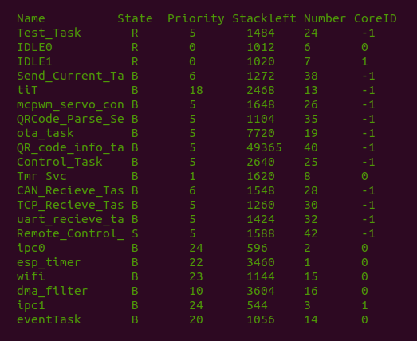
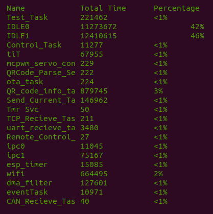
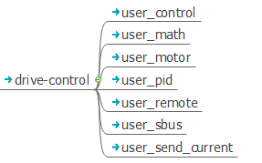

# 智能小车系统

## 系统启动流程


查阅源文件：[start_from_app_main](./_static/pdf/start_from_app_main.pdf)。

## 系统任务管理

### 系统任务简介

系统正常运行时，将启动以下 TASK。





其中，

* Name：TASK 名称；
* State：TASK状态    已阻止（'B'），就绪（'R'），已删除（'D'）或已暂停（'S'）
* Priority：TASK 优先级。
* StackLeft：TASK剩余堆栈空间；
* Number：TASK序号
* CoreID：TASK所在核
* Total Time：TASK总执行时间绝对值
* Percentage：CPU 占用率；

TASK 具体描述如下：

* Test_Task：测试任务（仅测试用），检测任务运行状态的栈使用情况
* Control_Task：根据遥控器各通道值来控制小车运动
* mcpwm_servo_control：货物搬运控制
* QRCode_Parse_Send_Task：将二维码内容格式化发送至TCP Client
* ota_task：检测到按键短按之后进行OTA更新
* QR_code_info_task：扫描二维码并解析二维码内容
* Send_Current_Task：通过CAN总线向电机发送电流
* TCP_Recieve_Task：TCP包接收并将命令进行解析
* uart_recieve_task：串口接受遥控器数据并解析
* Remote_Control_Task：根据不同TCP Client的命令来做出相应的控制动作
* CAN_Recieve_Task：接受CAN总线上的电机反馈消息并解析
* mdns_cam：视频网页同步
* IDLE0：空闲任务0 主要处理 `task watchdog` 和芯片睡眠 (`sleep`) 功能
* IDLE1：空闲任务1 主要处理 `task watchdog` 和芯片睡眠 (`sleep`) 功能
* tiT： `LWIP` 核心 task。负责整个 `TCP/IP` 协议栈的维护
* Tmr Svc： `FreeRTOS` 内部创建的 `timer task`。当前主要处理所有软件定时器功能
* ipc0：
* ipc1
* esp_timer
* wifi
* dma_filter
* eventTask

### 任务堆栈空间配置

用户可以在 `components/config/include/config.h` 中直接修改空间大小，也可以在 `menucfg` 中修改 `BASE_STACK_SIZE` 大小。

```c
#define configBASE_STACK_SIZE CONFIG_BASE_STACK_SIZE
//Task stack sizes
#define SLOW_FREQUENCY_TASK_STACKSIZE         (500)
#define FAST_FREQUENCY_TASK_STACKSIZE            (500)
#define OTA_TASK_STACKSIZE             (8 * configBASE_STACK_SIZE)
#define CREAT_TASK_STACKSIZE        (4 * configBASE_STACK_SIZE)
#define TEST_TASK_STACKSIZE        (2* configBASE_STACK_SIZE)
#define CONTROL_TASK_STACKSIZE     (3 * configBASE_STACK_SIZE)
#define CAN_RECIEVE_TASK_STACKSIZE            (2*configBASE_STACK_SIZE)
#define TCP_RECIEVE_TASK_STACKSIZE            (2 * configBASE_STACK_SIZE)
#define QRCODE_PARSE_SEND_TASK_STACKSIZE          (2 * configBASE_STACK_SIZE)
#define SEND_CURRENT_TASK_STACKSIZE        (3 * configBASE_STACK_SIZE)
#define MCPWM_SERVO_CONTROL_TASK_STACKSIZE     (2 * configBASE_STACK_SIZE)
#define UART_RECIEVE_TASK_STACKSIZE     (3 * configBASE_STACK_SIZE)
#define QR_CODE_INFO_TASK_STACKSIZE       (64 * configBASE_STACK_SIZE)
#define REMOTE_CONTROL_TASK_STACKSIZE        (2 * configBASE_STACK_SIZE)
```

### 任务优先级配置

系统 TASK 优先级可以在 `components/config/include/config.h` 中进行配置。由于 `ESP32` 具有双核优势，相比 `ESP32-S2` 计算资源更加富余，可将高耗时的 `KALMAN_TASK` 优先级调高。

```c
// Task priorities. Higher number higher priority
#define SLOW_FREQUENCY_TASK_PRI     6
#define FAST_FREQUENCY_TASK_PRI        6
#define OTA_TASK_PRI            6
#define CREAT_TASK_PRI           5
#define TEST_TASK_PRI    5
#define CONTROL_TASK_PRI        5
#define CAN_RECIEVE_TASK_PRI        6
#define TCP_RECIEVE_TASK_PRI          5
#define QRCODE_PARSE_SEND_TASK_PRI        5
#define SEND_CURRENT_TASK_PRI       6
#define MCPWM_SERVO_CONTROL_TASK_PRI      5
#define UART_RECIEVE_TASK_PRI             5
#define QR_CODE_INFO_TASK_PRI         5
#define REMOTE_CONTROL_TASK_PRI       5
```

## 小车底盘驱动

小车底盘驱动代码，可以在 `components\drivers` 中查阅。该组件将驱动程序按照功能进行分类，包括 `user_control`、`user_motor`、`user_remote` 等。




## 摄像头驱动

ESP-Intelligent-Vehicle进行二维码识别以及视频同步均要用到摄像头的组件，所用到的摄像头组件来源于[esp32-camera](https://github.com/espressif/esp32-camera)

其提供了适用于OV2640，OV3660，OV5640和OV7725图像传感器的ESP32驱动程序。同时，它还提供了一些工具，可以将其帧数据转换为更常见的BMP和JPEG格式。


## 舵机驱动

舵机其实就是较为简单的伺服电机，其内部具有一种位置伺服的驱动器，适用于那些需要角度不断变化并可以保持的控制系统。

故本项目将使用MCPWM模块来控制舵机

#### 引脚分配

```c
    mcpwm_gpio_init(MCPWM_UNIT_0, MCPWM0B, 2);
    mcpwm_gpio_init(MCPWM_UNIT_0, MCPWM0A, 12);
```

GPIO_2和GPIO_12被分配为伺服电机的MCPWM信号

#### 连线


GPIO_2和GPIO_12分别连接至一号舵机和二号舵机的信号线（即图上的黄色线），另外再通过5v电源给两只舵机进行供电（红色连接VCC，棕色连接GND）。

#### 初始化MCPWM

```c
    mcpwm_config_t pwm_config;
    pwm_config.frequency = 50; //frequency = 50Hz, i.e. for every servo motor time period should be 20ms
    pwm_config.cmpr_a = 0;     //duty cycle of PWMxA = 0
    pwm_config.cmpr_b = 0;     //duty cycle of PWMxb = 0
    pwm_config.counter_mode = MCPWM_UP_COUNTER;
    pwm_config.duty_mode = MCPWM_DUTY_MODE_0;
    mcpwm_init(MCPWM_UNIT_0, MCPWM_TIMER_0, &pwm_config); //Configure PWM0A & PWM0B with above settings

```

在PWM初始化的时候需要设置MCPWM定时器的频率（通常为50 Hz）、占空比、要使用的MCPWM通道，并将该通道与计时器之一绑定

>本项目中使用到的舵机属于180度舵机，即控制他转动的占空比在500us(0)到2500us(180),因为实际使用中只使用到90度，故将在500us(0)与1500us(90)之间进行调节占空比

#### 货物搬运动作执行

- 通过val变量获取遥控器上二位开关的状态，根据不同状态执行拿起和放下的动作。

```c
while (1){
    val = (uint16_t)Remote_PulseToSwitch_Two(Remote_GetVA());
    if (val != flag){				//判断二位开关状态是否改变，改变即向下进行，不改变任务被阻塞
        if (val == Remote_0){
            Put_down_Action();
            flag = 0x00;
        }else if (val == Remote_1){
            Pick_up_Action();
            flag = 0x01;
        }
    }
    vTaskDelay(1000 / portTICK_RATE_MS);
}
```

- 拿起和放下的动作流程又包含不同的动作步骤，通过switch case以及一个step变量进行动作的连贯操作。

```c
    int step = 1;
    while(step){
        switch (step)
        {
        case 1:
            Pick_up_Action1();
            step = 2;
            break;

        case 2:
            Pick_up_Action2();
            step = 3;
            break;

        case 3:
            Pick_up_Action3();
            step = 0;
            break;

        default:
            step = 1;
            break;
        }
        vTaskDelay(1000 / portTICK_RATE_MS);
    }
```


当然，当接收到TCP Client发过来的命令`pickup:`、`putdown:`时，TCP命令控制任务也会调用上述的货物搬运动作进行执行。


## UART驱动

项目中主要通过UART来接收遥控器数据

#### UART初始化

```c
     const uart_config_t uart_config = {
        .baud_rate = 100000,
        .data_bits = UART_DATA_8_BITS,
        .parity = UART_PARITY_EVEN,
        .stop_bits = UART_STOP_BITS_2,
        .flow_ctrl = UART_HW_FLOWCTRL_DISABLE,
    };
     //Install UART driver, and get the queue.
    uart_param_config(UART_NUM_1, &uart_config);
    uart_set_pin(UART_NUM_1, TXD_PIN, RXD_PIN, UART_PIN_NO_CHANGE, UART_PIN_NO_CHANGE);
    uart_driver_install(UART_NUM_1, RX_BUF_SIZE * 4, 0, 20, &uart1_queue, 0);
```

配置UART波特率为100000，八位数据位，偶校验，两位停止位，无硬件流控

#### 接线

将接收机的SBUS信号线通过反相器连接在GPIO_13

#### 接受数据

在uart_recieve_task中，通过调用uart_read_bytes()接收一个字节数据，然后再通过switch case进行SBUS协议的起始字节匹配，当起始字节和结束字节均匹配成功时，中间接收到的数据根据SBUS协议进行Decode解码后赋值给代表不同通道的结构体。

```c
for(;;) {
    uint8_t flag = 1;
    xQueueReceive(uart1_queue, (void * )&event, (portTickType)portMAX_DELAY);
    bzero(dtmp, 1024);
    switch(event.type) {
        case UART_DATA:
            read_len = uart_read_bytes(UART_NUM_1, dtmp, event.size, portMAX_DELAY);
            dtmp[read_len] = 0;
            const uint8_t *d = dtmp;
            static uint8_t RxState = 0, RxDataIndex = 0;
            while(flag){
                switch(RxState){
                    case 0:				//The start mark has not been detected yet, start to match the start mark
                        if(*d == 0x0F)
                        {
                            RxState++;
                            SBUS_MsgPack[0] = *d;
                            RxDataIndex = 1;
                        }
                        else
                            RxState = 0;
                        break;
                    case 1:					//Start mark matches, start to receive raw data
                        SBUS_MsgPack[RxDataIndex] = *d;
                        RxDataIndex++;
                        if(RxDataIndex >= 23)
                        {
                            RxDataIndex = 0;
                            RxState++;
                        }
                        break;
                    case 2:					//The data has been received, the first byte of the start matching end flag
                            SBUS_MsgPack[23] = *d;
                            RxState++;
                        break;
                    case 3:					//The first byte of the end flag is matched, and the second byte of the start matching end flag
                        if(*d == 0x00)
                        {
                            UpdateRemoteInfo((void*)&SBUS_MsgPack[0]);
                            SBUS_MsgPack[24] = 0x00;
                            RemoteUpdated = 1;
                        }
                        RxState = 0;
                        flag = 0;
                        break;
                    default:
                        RxState = 0;
                }
                d++;
            }
            break;

        default:
            break;
        }
}
```

```c
typedef struct Remote_t
{
	int16_t LX;
	int16_t LY;
	int16_t RX;
	int16_t RY;
	int16_t T1;
	int16_t S1;
	uint16_t VA;
	int16_t S2;
	int16_t T2;
} Remote_t;
```


## CAN驱动


----------------------------

未完待续